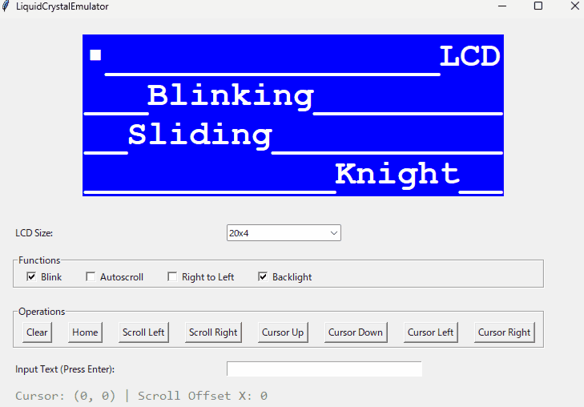

# LiquidCrystal (HD44780) Controller & Effect Wrapper

## Overview
This is a wrapper class for character LCDs (HD44780-based), commonly used in electronic projects with Arduino, ESP32, and other microcontrollers.It hides coordinate positioning and time management internally, allowing you to execute text display, clearing, and visual effects in an asynchronous style.This repository includes the main C++ version for microcontrollers and a Python version used as a simulator to check behavior on a PC.

## Problems Solved
- Redundant Code: Eliminates the need to call setCursor() and print() together every time.
- Complex State Management: Removes the need to manage millisecond timers or flags in the main loop when handling features like "clear after X seconds", "blinking", or "scrolling text".
## API Reference
The main control class (LiquidCrystalController) provides the following methods. All time parameters are specified in milliseconds (ms).
### print(text, x, y)
Displays text permanently at the specified coordinates (x, y).
### print_t(text, x, y, life_time, delay_time=0)
Displays text for a specified duration (life_time) and clears it automatically. You can delay the appearance using delay_time.
### blink(text, x, y, life_time, effect_speed=500, delay_time=0)
Blinks the text at a specific interval (effect_speed) for the duration of life_time.
### slide(text, x, y, width, life_time, effect_speed=100, direction=1, delay_time=0)
Scrolls text within a specific window size (width). direction toggles the movement (1: right / -1: left).
### knight(text, x, y, width, life_time, effect_speed=100, direction=1, delay_time=0)
Moves text back and forth within a specific window size (width). direction=-1 starts from the right.
### update(now)
Must be called in every cycle of the main loop by passing the current millisecond timestamp (now). It handles task time-management and flushes data to the LCD.

## Known Issues / Limitations
Area Overlap Conflict: Once a task becomes active, it occupies that specific display area. The area cannot be used by other tasks until the active task expires. Newly registered tasks can overwrite existing ones, meaning there is room for improvement regarding layer management or task prioritization.

## Conclusion
This wrapper simplifies temporary status updates and visual effects on character LCDs. Future updates will focus on fixing task conflicts and adjusting behavior during actual hardware operations.

